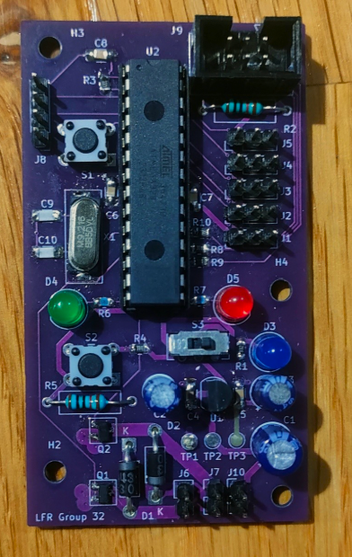

# Line-Following Robot - Main PCB

Custom main PCB designed for a university line-following robot project.

I was responsible for the schematic design, component selection, PCB layout, and hardware testing of the main controller board. 
The board integrates an ATmega328P, regulated power, motor switching, analogue line sensors, user input, and ISP programming.

The mechanical platform and control software were developed by other members of the team.

---

---

## Project Overview

The PCB was designed to provide the electrical platform for a small autonomous line-following robot.

### Key requirements

- ATmega328P-based control
- Five analogue reflectance sensors
- Two independently controlled DC motors
- 3.3 V regulated supply
- ISP programming
- User input and status indication
- Reliable operation despite motor-induced supply transients

## My Contribution

I was primarily responsible for the electronics and PCB design:

- Schematic capture and circuit design in KiCad
- Component selection and datasheet research
- Power supply and decoupling design
- Motor driver circuit
- Analogue sensor interface
- ATmega328P peripheral connections
- Crystal oscillator design
- ISP programming interface
- PCB layout and routing
- Hardware assembly and functionality testing
- Component-level debugging and modification

The mechanical chassis and control software were developed by
other members of the team.

## Hardware Architecture

### Microcontroller

**ATmega328P**

The MCU provides:

- ADC inputs for five reflectance sensors
- GPIO for control and status
- SPI for ISP programming
- External 9.216 MHz crystal oscillator

### Power

The board uses a dedicated 3.3 V linear regulator with multiple
levels of decoupling:

- 100 nF local decoupling at MCU supply pins
- 10 µF / 22 µF regulator-side capacitance
- 220 µF bulk capacitance at the battery input

The bulk capacitance was included to reduce supply disturbances
caused by motor current transients.

### Motor Drive

Each motor is controlled using a low-side N-channel MOSFET.

Flyback Schottky diodes provide a current path when the motor
switches off, limiting inductive voltage transients.

### Line Sensors

Five TCRT5000 reflectance sensors provide analogue measurements
through the ATmega328P ADC.

Rather than reducing the sensors to binary black/white states,
the analogue signal was retained to provide the control software
with continuous reflectance information.

## Design Considerations

### Crystal Oscillator

The 9.216 MHz crystal load capacitors were calculated using the
crystal's specified load capacitance and estimated stray
capacitance rather than selecting a standard capacitor value
without calculation.

### ISP Interface

The SPI programming interface includes 330 Ω series resistors on
SCLK, MOSI and MISO.

These were selected to limit transient current while maintaining
appropriate signal levels at the 3.3 V logic voltage.

### PCB Layout

Particular attention was given to separating sensitive analogue
sensor routing from the high-current motor switching paths.

Decoupling capacitors were positioned close to their associated
supply pins, and the ground plane was maintained as continuously
as practical around the sensor circuitry.

## Hardware Bring-Up & Iteration

The first hardware revision provided several useful lessons that
would not have been apparent from schematic or simulation alone.

During bring-up I identified and corrected several issues,
including:

- Status LED initially producing substantially more light than
  intended; the series resistor was recalculated and replaced.
- A power-switch footprint was found to have incorrect pin mapping;
  the physical component was adapted to match the intended circuit.
- Motor supply behaviour highlighted the importance of bulk
  capacitance and supply integrity during high-current transients.

These iterations were useful in demonstrating the difference
between a theoretically correct circuit and a practical PCB
operating in a complete electromechanical system.

## Project Outcome

The PCB itself was successfully assembled and brought up.

However, the complete line-following robot did not achieve the
intended performance. Problems encountered during integration
were primarily associated with the mechanical platform and the
interaction between the electrical and mechanical systems.

This was an important lesson in system-level engineering: a
functional subsystem does not necessarily result in a functional
complete system when mechanical, electrical and software
interfaces are not considered together.

## Skills Demonstrated

- KiCad schematic capture and PCB layout
- ATmega328P embedded hardware
- Mixed analogue/digital PCB design
- Power supply design
- Decoupling and transient management
- MOSFET motor switching
- Flyback protection
- Analogue sensor interfacing
- ADC design
- SPI / ISP programming
- Datasheet-based component selection
- Circuit calculations
- Hardware bring-up and debugging
- PCB fabrication and assembly
- System-level engineering

## Resources

- [KiCad Schematic](./images/full_skem.png)
- [PCB Layout](./images/fullPCB.png)
- [PCB Design Files](./PCB_design/)
- [Board Photos](./board.md)
- [Project Report](./LFR_report.pdf)

---
*Developed as part of a university group project. Main PCB design and electronics by myself (Curtis Christian); other tasks covered in the report are done as collabarative effort by our group.*
